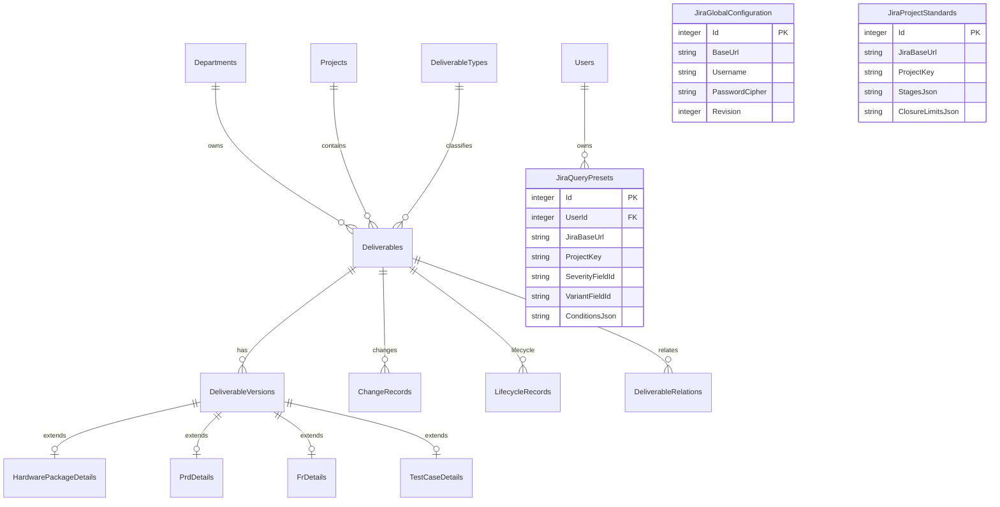

# 数据库关系

```mermaid
erDiagram
  Departments ||--o{ Deliverables : owns
  Projects ||--o{ Deliverables : contains
  DeliverableTypes ||--o{ Deliverables : classifies
  Deliverables ||--o{ DeliverableVersions : has
  DeliverableVersions ||--o| HardwarePackageDetails : extends
  DeliverableVersions ||--o| PrdDetails : extends
  DeliverableVersions ||--o| FrDetails : extends
  DeliverableVersions ||--o| TestCaseDetails : extends
  Deliverables ||--o{ ChangeRecords : changes
  Deliverables ||--o{ LifecycleRecords : lifecycle
  Deliverables ||--o{ DeliverableRelations : relates
  Users ||--o{ JiraQueryPresets : owns
  JiraGlobalConfiguration {
    integer Id PK
    string BaseUrl
    string Username
    string PasswordCipher
    integer Revision
  }
  JiraProjectStandards {
    integer Id PK
    string JiraBaseUrl
    string ProjectKey
    string StagesJson
    string ClosureLimitsJson
  }
  JiraQueryPresets {
    integer Id PK
    integer UserId FK
    string JiraBaseUrl
    string ProjectKey
    string SeverityFieldId
    string VariantFieldId
    string ConditionsJson
  }
```
